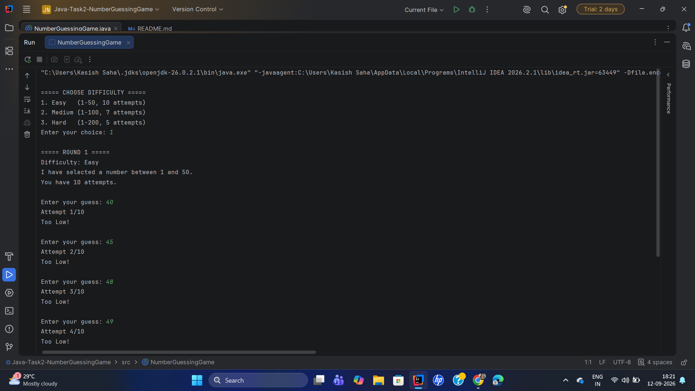
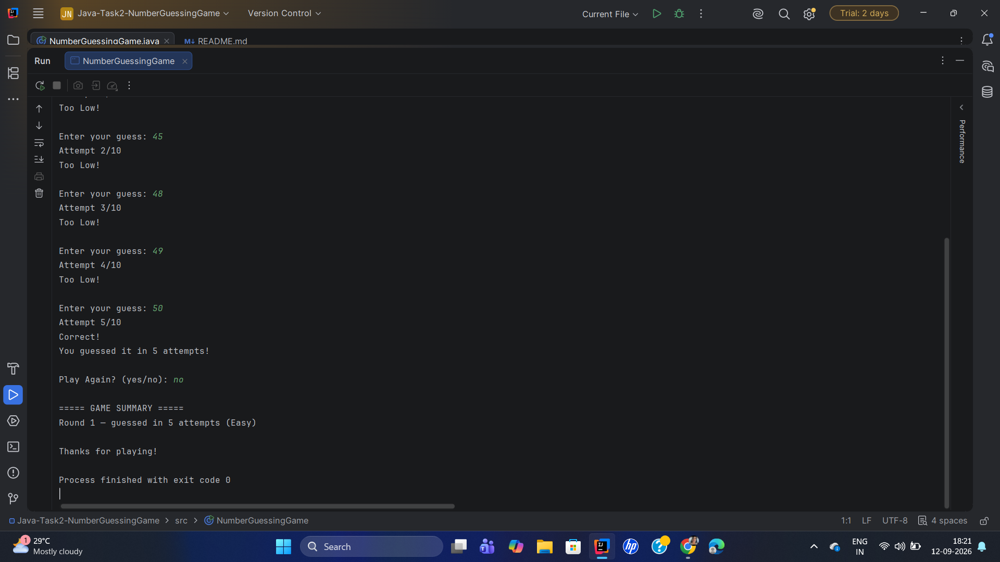

# Number Guessing Game

## Project Overview

The Number Guessing Game is a Java console-based game where the computer generates a random number and the player tries to guess it.

After each guess, the game provides a hint indicating whether the guessed number is too high or too low. The game continues until the player guesses the correct number or reaches the maximum number of attempts.

## Features

* Random number generation
* Easy, Medium, and Hard difficulty levels
* Different number ranges and attempt limits
* Too High and Too Low hints
* Correct answer notification
* Attempt counter
* Invalid input handling
* Correct number revealed when the player loses
* Play Again option
* Multiple round support
* Round results summary

## Difficulty Levels

| Difficulty | Number Range | Maximum Attempts |
| ---------- | ------------ | ---------------- |
| Easy       | 1 - 50       | 10               |
| Medium     | 1 - 100      | 7                |
| Hard       | 1 - 200      | 5                |

## Technologies Used

* Java
* `Random` for random number generation
* `Scanner` for user input
* `ArrayList` for storing round results
* `while` loops
* `if-else` statements

## How to Run

1. Open the project in IntelliJ IDEA.
2. Open `NumberGuessingGame.java`.
3. Run the `main()` method.
4. Select a difficulty level.
5. Enter a number within the displayed range.
6. Follow the hints to guess the correct number.
7. Choose `yes` to play another round or `no` to exit.

## Game Flow

1. Select a difficulty level.
2. The computer generates a random number.
3. Enter a guess.
4. Receive a **Too High** or **Too Low** hint.
5. Continue guessing until the number is found or attempts are exhausted.
6. View the round result.
7. Choose whether to play another round.
8. View the final game summary.

## Project Structure

```text
Java-Task2-NumberGuessingGame/
├── src/
│   └── NumberGuessingGame.java
├── screenshots/
│   ├── OutputSS1.png
│   └── OutputSS2.png
├── README.md
└── .gitignore
```

## Screenshots

### Game Output 1



### Game Output 2



## OIBSIP

This project was developed as part of the **OIBSIP Java Development Internship**.

## Author

**Kasish Saha**
