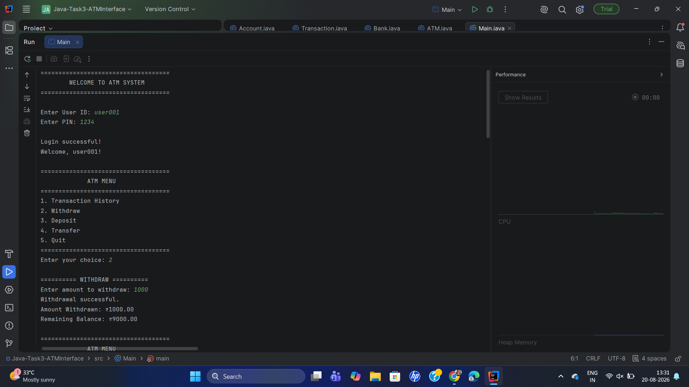
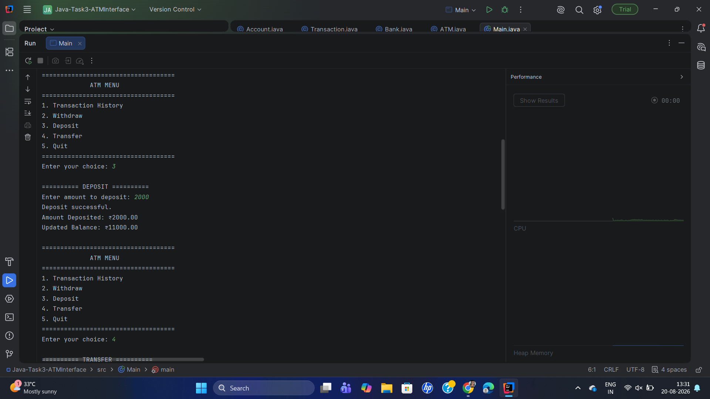
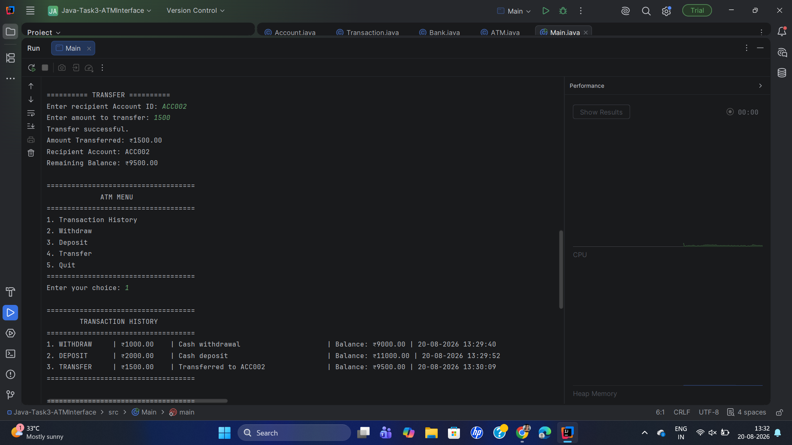
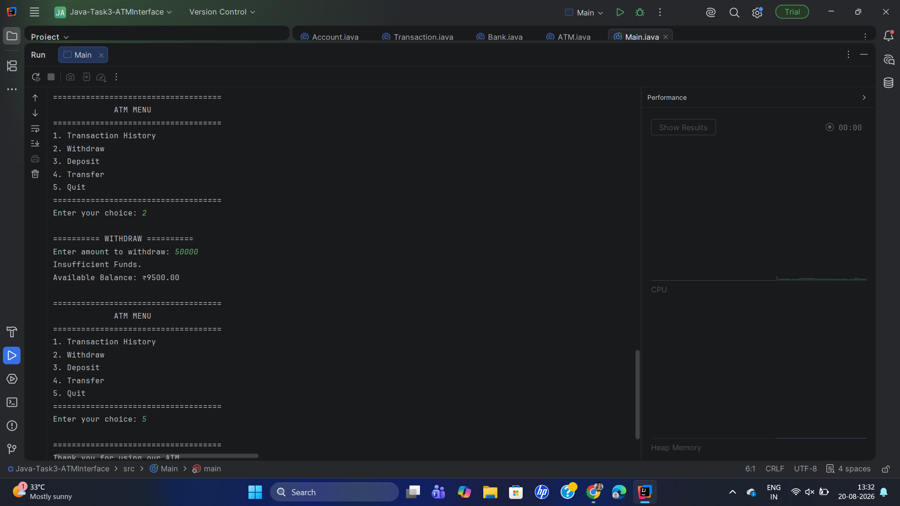
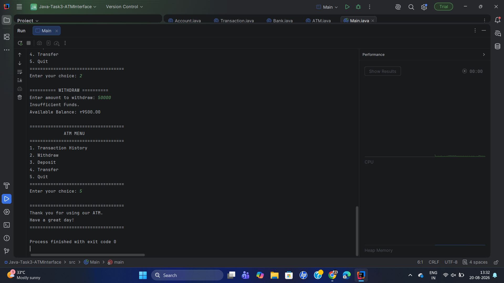

# ATM Interface

A console-based ATM simulation developed in **Java** using **Object-Oriented Programming (OOP)** principles. The application allows users to securely log in with a User ID and PIN and perform common banking operations such as withdrawal, deposit, transfer, and transaction history viewing.

---

## Project Overview

The ATM Interface simulates the basic functionality of an Automated Teller Machine through a Java console application.

The project demonstrates important Java concepts including:

- Object-Oriented Programming
- Encapsulation
- Multiple classes
- `ArrayList` for transaction history
- `switch-case` for menu handling
- Input validation
- Account balance management
- Authentication with limited login attempts

---

## Features

- User ID and PIN authentication
- Maximum of 3 incorrect login attempts
- Transaction history for the current session
- Cash withdrawal
- Cash deposit
- Account-to-account money transfer
- Balance validation before withdrawal and transfer
- "Insufficient Funds" validation
- Automatic transaction logging
- Multiple bank accounts
- Quit option with a goodbye message
- Invalid input handling

---

## Technologies Used

- **Language:** Java
- **Application Type:** Console Application
- **IDE:** IntelliJ IDEA
- **Data Structure:** `ArrayList`
- **Concepts:** Object-Oriented Programming (OOP)

---

## Project Structure

```text
Java-Task3-ATMInterface/
│
├── src/
│   ├── ATM.java
│   ├── Account.java
│   ├── Bank.java
│   ├── Main.java
│   └── Transaction.java
│
├── screenshots/
│   ├── OutputSS1.png
│   ├── OutputSS2.png
│   ├── OutputSS3.png
│   ├── OutputSS4.png
│   └── OutputSS5.png
│
├── .gitignore
└── README.md
```

---

## Class Description

| Class | Description |
|---|---|
| `Main` | Entry point of the application and creates sample bank accounts |
| `ATM` | Handles login, menu display, and ATM operations |
| `Account` | Stores account details and manages balance and transactions |
| `Transaction` | Represents individual banking transactions |
| `Bank` | Manages multiple accounts, authentication, and transfers |

---

## Test Accounts

The application includes two sample accounts for testing.

| User ID | PIN | Account ID | Starting Balance |
|---|---|---|---:|
| `user001` | `1234` | `ACC001` | ₹10,000 |
| `user002` | `5678` | `ACC002` | ₹5,000 |

> **Note:** These credentials are included only for testing this console application.

---

## ATM Menu

After successful authentication, the following menu is displayed:

```text
====================================
             ATM MENU
====================================
1. Transaction History
2. Withdraw
3. Deposit
4. Transfer
5. Quit
====================================
```

### 1. Transaction History

Displays all transactions performed by the logged-in account during the current session.

### 2. Withdraw

Allows the user to withdraw money after checking whether the account has sufficient funds.

If the requested amount is greater than the available balance, the application displays:

```text
Insufficient Funds.
```

### 3. Deposit

Allows the user to deposit money into their account and automatically records the transaction.

### 4. Transfer

Allows the user to transfer money to another account using the recipient's Account ID.

The application validates:

- Recipient account existence
- Positive transfer amount
- Sufficient sender balance
- Prevention of transfers to the same account

### 5. Quit

Terminates the ATM session and displays a goodbye message.

---

## Authentication

The ATM requires both:

- User ID
- PIN

Users are given a maximum of **3 login attempts**.

After three incorrect attempts, access is denied.

```text
Maximum login attempts exceeded.

Access Denied.
Thank you for using the ATM.
```

---

## Transaction Management

All transactions are stored using an `ArrayList<Transaction>` within each account.

Transactions record information such as:

- Transaction type
- Amount
- Description
- Date and time
- Balance after the transaction

This allows the application to display a clear transaction history.

---

## OOP Concepts Demonstrated

### Encapsulation

Account and transaction information is stored using private fields with appropriate getter methods.

### Classes and Objects

The application is divided into five classes, each with a specific responsibility.

### Abstraction

The complexity of banking operations is separated into classes such as `ATM`, `Bank`, and `Account`.

### Object Interaction

Objects communicate with each other to perform authentication, deposits, withdrawals, and transfers.

---

## How to Run

### Prerequisites

- Java Development Kit (JDK) installed
- IntelliJ IDEA or another Java IDE

### Steps

1. Open the project in IntelliJ IDEA.
2. Open the `src` folder.
3. Open `Main.java`.
4. Run the `main()` method.
5. Enter one of the test User IDs and PINs.
6. Select an option from the ATM menu.
7. Perform the required transaction.

### Example Login

```text
Enter User ID: user001
Enter PIN: 1234
```

---

## Screenshots

### ATM Login and Menu



### Deposit



### Transaction & Transaction History



### Insufficient Funds



### ATM Output



---

## Future Improvements

Possible future enhancements include:

- Graphical User Interface (GUI)
- Persistent database storage
- Password/PIN encryption
- Receipt generation
- Account creation and deletion
- Daily transaction limits
- More detailed account statements
- Improved security features

---

## Learning Outcomes

Through this project, I gained practical experience in:

- Java programming
- Object-Oriented Programming
- Encapsulation and class design
- Collections using `ArrayList`
- User input handling
- Authentication logic
- Banking transaction management
- Developing a structured console application

---

## Internship Task

**Program:** Oasis Infobyte Internship (OIBSIP)

**Track:** Java Development

**Task:** Task 3 - ATM Interface

---

## Author

**Kasish Saha**

This project was developed as part of the **OIBSIP Java Development Internship**.
