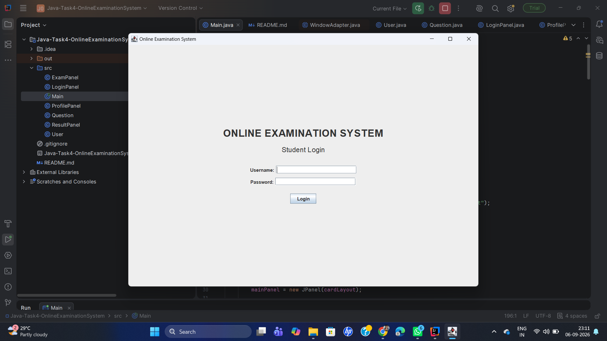
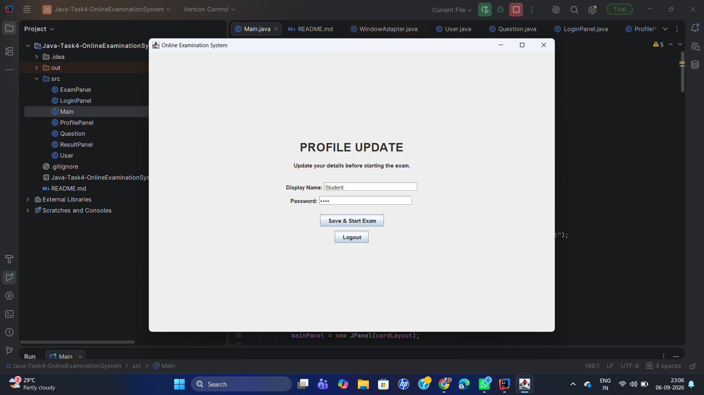
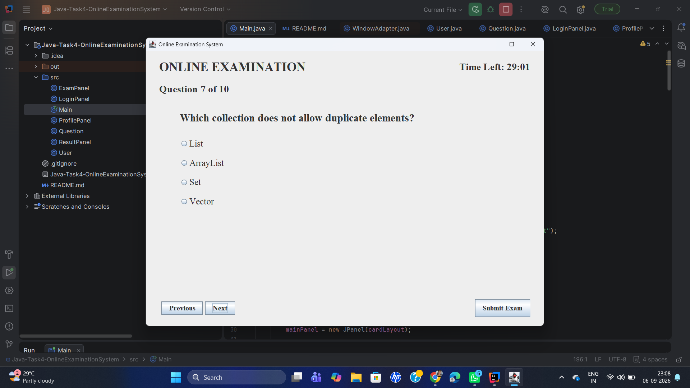
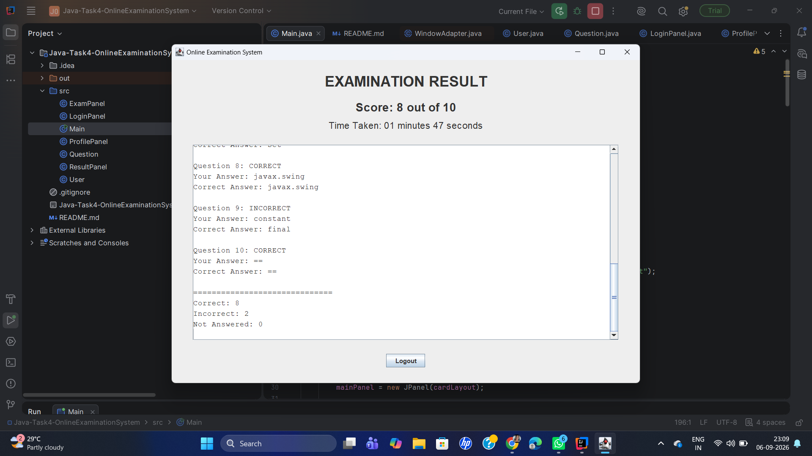

# Online Examination System

## Project Overview

The Online Examination System is a Java-based GUI application developed using Swing. It allows students to log in, update their profile, attend a multiple-choice examination, and view their results after submission.

The examination includes a countdown timer, question navigation, answer selection, automatic submission when the time expires, and a detailed result analysis.

## Features

* Username and password login
* Profile update before starting the examination
* Display name and password update
* Multiple-choice questions with four options
* One question displayed at a time
* Previous and Next navigation
* 30-minute countdown timer
* Automatic submission when the timer reaches zero
* Manual exam submission
* Submission confirmation dialog
* Score calculation
* Correct and incorrect answer identification
* Time taken calculation
* Detailed question-by-question result analysis
* Logout option
* Close-window confirmation during the examination
* Times New Roman font throughout the application

## Technologies Used

* Java
* Java Swing
* `Timer` for the countdown timer
* `JRadioButton` for multiple-choice options
* `ButtonGroup` for grouping answer options
* `JPanel` for creating GUI sections
* `JFrame` for the main application window
* `JOptionPane` for dialogs and confirmations
* `ArrayList` for storing questions and user answers

## How to Run

1. Open the project in IntelliJ IDEA.
2. Open the `Main.java` file.
3. Run the `main()` method.
4. Enter the username and password.
5. Update the profile information if required.
6. Start the examination.
7. Select an answer for each question.
8. Use the `Previous` and `Next` buttons to navigate between questions.
9. Submit the examination using the `Submit Exam` button or wait for the timer to expire.
10. View the final score and detailed result analysis.
11. Click `Logout` to return to the login screen.

## Exam Flow

1. Enter username and password.
2. Login successfully.
3. Update display name and password.
4. Start the examination.
5. Read the question and select an answer.
6. Navigate using the `Previous` and `Next` buttons.
7. Monitor the countdown timer.
8. Submit the examination manually or automatically when the timer reaches zero.
9. View the score and detailed result analysis.
10. Logout and return to the login screen.

## Project Structure

```text
Java-Task4-OnlineExaminationSystem/
├── src/
│   ├── Main.java
│   ├── User.java
│   ├── Question.java
│   ├── LoginPanel.java
│   ├── ProfilePanel.java
│   ├── ExamPanel.java
│   └── ResultPanel.java
├── screenshots/
│   ├── LoginSS.png
│   ├── ProfileSS.png
│   ├── ExamSS.png
│   └── ResultSS.png
├── README.md
└── .gitignore
```
## Screenshots

### Login Screen



### Profile Update Screen



### Examination Screen



### Result Screen



## OIBSIP

This project was developed as part of the **OIBSIP Java Development Internship**.

## Author

**Kasish Saha**
